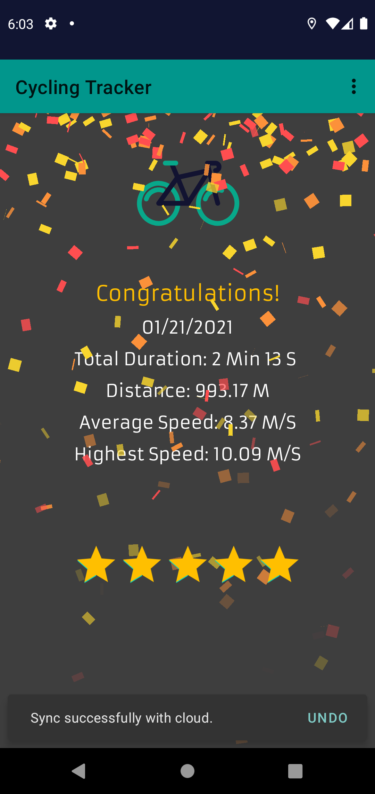

# Cycling Tracker

Cycling Tracker is an Android app that helps a user to track exercising data and history. It shows and record instant data while cycling, and motivates the user when necessary. It stores exercising details, including but not limit to duration, track, highest speed, on Firebase backend, allowing a user to access his or her cycling history to discover patterns of personal exercing habits.  

## 🧐Features 

* Show a dashboard of exercisng data, such as traveled distance, instant speed, altitude, etc..
* Provide a map, updating current location and track in real time.
* Provide a plot of cycling speed vs instant time. 
* Allow the user to modify units, font size, font type for better user experience.
* Motivate the user, if his or her current speed is lower than average history speed.
* Show statistical details of exercising, when the user ends tracking.
* Allow the user to rate a cycling track.
* Show a comprehensive detail of past exercising history.

The basic code structure of this demo was an one-month group project in the class "Principle of Software in Scale" at BU with four classmates, the link to our class project is [here](https://github.com/LyapunovJingci/Cycling_Tracker_EC500). Code refactoring was performed and several new features were added based on personal interest.

## 📝API & Platform Usage

* [Google Maps SDK for Android](https://developers.google.com/maps/documentation/android-sdk/intro)
* [Google Maps Static API](https://developers.google.com/maps/documentation/maps-static/overview)
* [Geocoding API](https://developers.google.com/maps/documentation/geocoding/overview)
* [Firebase](https://firebase.google.com/)

## 📝Library Usage

* [OkHttp](https://github.com/square/okhttp)
* [Picasso](https://github.com/square/picasso) 
* [MPAndroidChart](https://github.com/PhilJay/MPAndroidChart)
* [Lottie](https://github.com/airbnb/lottie-android)
* [Konfetti](https://github.com/DanielMartinus/Konfetti)

## 🎈Screenshots

&#160;
&#160;
&#160;
&#160;

## License

MIT License

Copyright (c) 2021 Jingci Li

Permission is hereby granted, free of charge, to any person obtaining a copy
of this software and associated documentation files (the "Software"), to deal
in the Software without restriction, including without limitation the rights
to use, copy, modify, merge, publish, distribute, sublicense, and/or sell
copies of the Software, and to permit persons to whom the Software is
furnished to do so, subject to the following conditions:

The above copyright notice and this permission notice shall be included in all
copies or substantial portions of the Software.

THE SOFTWARE IS PROVIDED "AS IS", WITHOUT WARRANTY OF ANY KIND, EXPRESS OR
IMPLIED, INCLUDING BUT NOT LIMITED TO THE WARRANTIES OF MERCHANTABILITY,
FITNESS FOR A PARTICULAR PURPOSE AND NONINFRINGEMENT. IN NO EVENT SHALL THE
AUTHORS OR COPYRIGHT HOLDERS BE LIABLE FOR ANY CLAIM, DAMAGES OR OTHER
LIABILITY, WHETHER IN AN ACTION OF CONTRACT, TORT OR OTHERWISE, ARISING FROM,
OUT OF OR IN CONNECTION WITH THE SOFTWARE OR THE USE OR OTHER DEALINGS IN THE
SOFTWARE.

